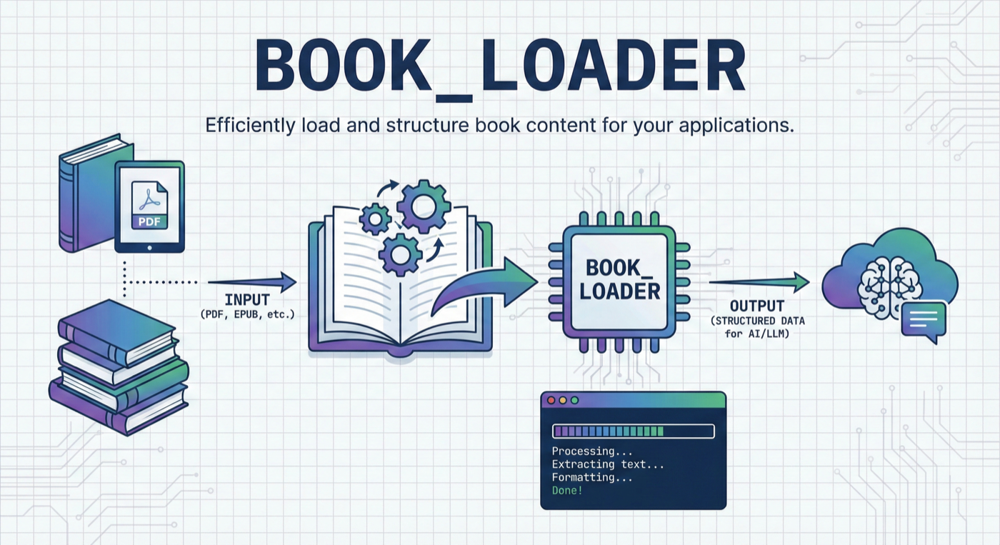

# Book Loader

[English](README.md) | [繁體中文](README.zh-TW.md)



Adobe ACSM ebook DRM removal tool - Supports anonymous and Adobe ID authorization

---

## ⚠️ LEGAL NOTICE AND USAGE RESTRICTIONS

**READ CAREFULLY BEFORE USE**

This software is provided strictly for **educational, research, and personal backup purposes only**. By using this tool, you acknowledge and agree to the following terms:

### Legal Restrictions

1. **Copyright Compliance**: This tool must ONLY be used with ebooks that you have **legally purchased** or have explicit authorization to access. Unauthorized removal of DRM from copyrighted content may violate:
   - The Digital Millennium Copyright Act (DMCA) in the United States
   - The EU Copyright Directive
   - Similar copyright protection laws in your jurisdiction

2. **Prohibited Activities**: The following uses are **STRICTLY PROHIBITED**:
   - Commercial redistribution of DRM-free ebooks
   - Sharing DRM-free ebooks with unauthorized parties
   - Circumventing DRM for piracy or copyright infringement
   - Any use that violates the terms of service of ebook vendors

3. **Personal Use Only**: This tool is intended solely for creating personal backup copies of legitimately purchased ebooks for use across your own devices.

### Disclaimer

- **NO WARRANTY**: This software is provided "AS IS" without warranty of any kind, express or implied.
- **LIABILITY**: The authors and contributors assume NO LIABILITY for any misuse, legal consequences, or damages arising from the use of this software.
- **USER RESPONSIBILITY**: Users are solely responsible for ensuring their use complies with applicable laws and terms of service in their jurisdiction.

### Developer Statement

This project is developed for legitimate interoperability and personal backup purposes. The developers do not condone or support piracy, copyright infringement, or any illegal activity.

**If you do not agree to these terms or cannot ensure legal compliance, DO NOT USE this software.**

---

## Features

- ✅ Process ACSM files, output DRM-free EPUB/PDF
- ✅ Support anonymous authorization (no Adobe account required)
- ✅ Support Adobe ID authorization (can be used on multiple devices)
- ✅ No need to install Adobe Digital Editions
- ✅ Pure Python implementation, cross-platform support
- ✅ Backup and restore authorization (tar.gz archive)

## Installation

Requires Python 3.10 or later.

```bash
git clone https://github.com/spreered/book_loader.git
cd book_loader
pip install -e .
```

## Usage

### Quick Start

```bash
# Simplest way: process ACSM directly (will automatically create anonymous authorization)
book-loader process book.acsm

# Specify output directory
book-loader process book.acsm -o ~/Books/
```

### Authorization Management

#### Create New Authorization

```bash
# Method 1: Anonymous authorization (default, no Adobe account required)
book-loader auth create --anonymous

# Method 2: Adobe ID authorization (can be used on up to 6 devices)
book-loader auth create --adobe-id --email your@email.com

# View authorization information
book-loader auth info

# Reset authorization (automatically creates a backup before deleting)
book-loader auth reset
```

#### Backup and Restore Authorization

```bash
# Backup authorization (interactive prompt for destination, default: ~/adobe-ade-auth-bk/)
book-loader auth backup

# Backup to a specific directory
book-loader auth backup -o ~/my-backups/

# Restore authorization (interactive menu to select from available backups)
book-loader auth restore

# Restore from a specific backup file
book-loader auth restore --file ~/adobe-ade-auth-bk/auth_AdobeID_20260217_004129.tar.gz

# Restore from backups in a specific directory
book-loader auth restore --backup-dir ~/my-backups/
```

> **Note**: `auth reset` automatically creates a backup to `~/adobe-ade-auth-bk/` before deleting authorization files, so you can always restore if needed.

#### Using Existing Authorization (Advanced)

If you already have Adobe Digital Editions (ADE) authorization, you can use it directly:

```bash
# Use ADE's authorization directory
book-loader process book.acsm \
  --auth-dir ~/Library/Application\ Support/Adobe/Digital\ Editions/

# Or use custom authorization directory
book-loader process book.acsm --auth-dir /path/to/auth/
```

**Note**: ADE authorization directory may contain both anonymous and Adobe ID authorizations. The tool will prioritize:
- `activation.xml` + `device.xml` + `devicesalt` (old format authorization)
- `activation.dat` (ADE 4.5+ format)

### System Information

```bash
# Display system information
book-loader info
```

## Important Concepts

### ACSM Files and Transaction ID

**ACSM (Adobe Content Server Manager)** is not the ebook itself, but a "download voucher":

1. **Transaction ID is generated at purchase time**
   - Each purchase generates a unique Transaction ID
   - Downloading ACSM for the same book on different devices has the same Transaction ID
   - Even if you re-download the ACSM, the Transaction ID remains the same

2. **ACSM can only be fulfilled once**
   - After fulfillment, ACSM is bound to a specific authorization
   - Adobe server records that this Transaction has been used
   - Cannot reuse the same ACSM on other devices or authorizations

3. **How to check Transaction ID**
   ```bash
   # View the Transaction ID of an ACSM
   grep transaction your-book.acsm

   # View Transaction IDs of all ACSMs
   grep transaction ~/Downloads/*.acsm
   ```

### Authorization Type Comparison

| Authorization Type | Account Required | Device Limit | Use Case |
|---------|---------|---------|---------|
| **Anonymous** | ❌ No | ⚠️ Single device only | Single device, privacy-focused |
| **Adobe ID** | ✅ Yes | ✅ Up to 6 devices | Multi-device sync |

### Multi-Device Usage Recommendations

**❌ Wrong Approach:**
```bash
# Fulfill ACSM on Device A
book-loader process book.acsm

# Fulfill the same ACSM again on Device B
book-loader process book.acsm  # ❌ Will fail! Transaction already used
```

**✅ Correct Approach:**
```bash
# Fulfill and remove DRM on Device A
book-loader process book.acsm -o ~/Books/
# Produces: ~/Books/book.epub (DRM-free)

# Copy the DRM-free file to Device B
# Can be used directly without re-fulfilling ACSM
```

## FAQ

### Q: Why do I get "E_LIC_ALREADY_FULFILLED_BY_ANOTHER_USER" error?

**Reason**: This ACSM (Transaction) has already been used by an authorization.

**Possible scenarios**:
1. Previously opened this book in Adobe Digital Editions
2. Processed this ACSM with other tools
3. Re-downloaded the same book's ACSM (same Transaction ID)

**Solutions**:
- If previously opened in ADE: Use `--auth-dir` to specify ADE's authorization directory
- If file was deleted: Cannot re-fulfill, need to find the original ebook file
- If it's a brand new book: Confirm it hasn't been opened with other authorizations

### Q: How to check if a book has been fulfilled?

Check the UUID in the error message:

```bash
# Error message example:
# E_LIC_ALREADY_FULFILLED_BY_ANOTHER_USER ... urn:uuid:2b60b2eb-...

# View your authorization UUID
grep "user>" ~/.config/book-loader/.adobe/activation.xml
```

If the UUID matches, it was fulfilled by your authorization; if not, it was fulfilled by another authorization.

### Q: Can I use multiple authorizations simultaneously?

Yes! Use `--auth-dir` to specify different authorization directories:

```bash
# Use authorization A
book-loader process book1.acsm --auth-dir ~/auth-a/

# Use authorization B
book-loader process book2.acsm --auth-dir ~/auth-b/
```

### Q: How to backup authorization?

Use the built-in backup command:

```bash
# Interactive backup (prompts for destination, default: ~/adobe-ade-auth-bk/)
book-loader auth backup

# Backup to a specific directory
book-loader auth backup -o ~/my-backups/
```

The backup is saved as a `.tar.gz` archive with a timestamped filename (e.g., `auth_AdobeID_20260217_004129.tar.gz`).

To restore, use:
```bash
# Interactive restore (lists available backups)
book-loader auth restore

# Restore from a specific file
book-loader auth restore --file ~/adobe-ade-auth-bk/auth_AdobeID_20260217_004129.tar.gz
```

> **Note**: `auth reset` automatically creates a backup before deleting, so you won't accidentally lose your authorization.

### Q: Can I retry after processing fails?

Depends on the failure stage:
- ✅ **Fulfillment succeeded, but download failed**: Can retry (Transaction not consumed)
- ✅ **DRM removal failed**: Can retry (downloaded encrypted file still exists)
- ❌ **Fulfillment succeeded and download complete**: Transaction consumed, cannot retry

## License

GPLv3

This project integrates the following open-source code:
- [acsm-calibre-plugin](https://github.com/Leseratte10/acsm-calibre-plugin) - GPLv3
- [DeDRM_tools](https://github.com/noDRM/DeDRM_tools)

## Disclaimer

**IMPORTANT**: This tool is strictly for personal, legal use with legitimately purchased ebooks only.

**Violating copyright laws or terms of service may result in civil and criminal penalties.** Users bear full responsibility for ensuring their usage complies with all applicable laws and regulations in their jurisdiction.

The developers explicitly disclaim any responsibility for misuse of this software.
